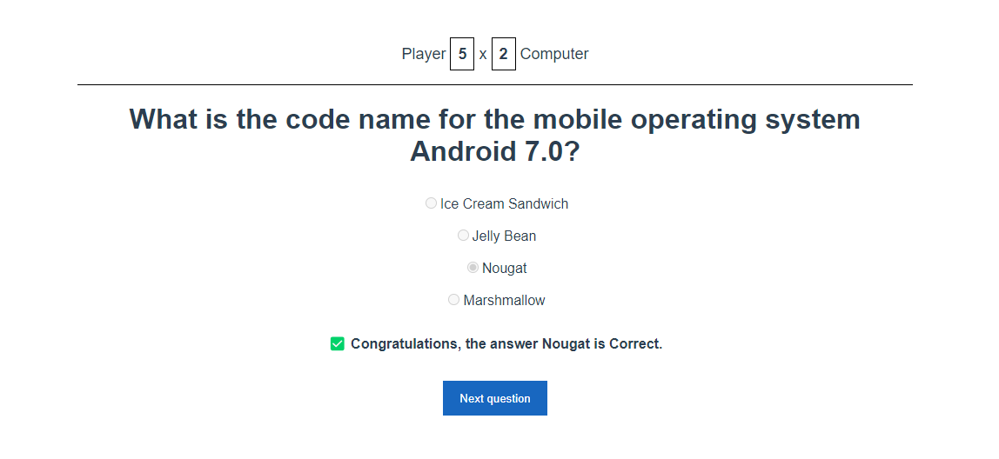

<h1 align="center">Quiz Game</h1>

  

## 🚀 Tecnologias

Esse projeto foi desenvolvido com as seguintes tecnologias:

- HTML
- CSS
- JavaScript
- Axios
- VueJS

## 💻 Projeto

Um projeto simples feito com VueJS de um jogo de perguntas e respotas usando a API do Open Trivia (https://opentdb.com/api).

---

Feito com ♥ by Cleber-Risu
